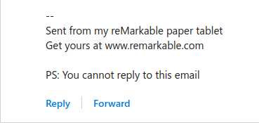
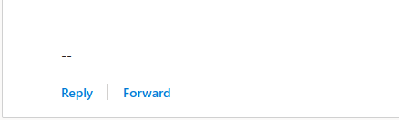

# rM-signature-patch
Simple script to remove that pesky advert at the bottom of a mail originating from a reMarkable.

## Prerequisites for >= v3.6
This script relies on `opkg`, which is not installed by default on reMarkable devices.
You can install it through [toltec](https://github.com/toltec-dev/toltec).

## Installation
1. SSH into your reMarkable
2. Paste the following and press enter:  
`sh -c "$(wget https://raw.githubusercontent.com/Barabazs/rM-signature-patch/main/signature-patch.sh -O-)"`
3. Test it by sending a mail to yourself.

## How it works
The script first checks if Perl is installed and will install it if necessary.  
Then it will search for a specific string in Xochitl (the rM software) and replace a part of it so it won't be included at the bottom of your emails.
And finally the script restarts Xochitl and you're done.

### Before

### After  

## Disclaimer
* Read the license!
* Take a proper backup! 

   

## Donations

|Ethereum|Bitcoin|
|:-:	|:-:	|
|0x6b78d3deea258914C2f4e44054d22094107407e5|bc1qvvh8s3tt97cwy20mfdttpwqw0vgsrrceq8zkmw|
|||
